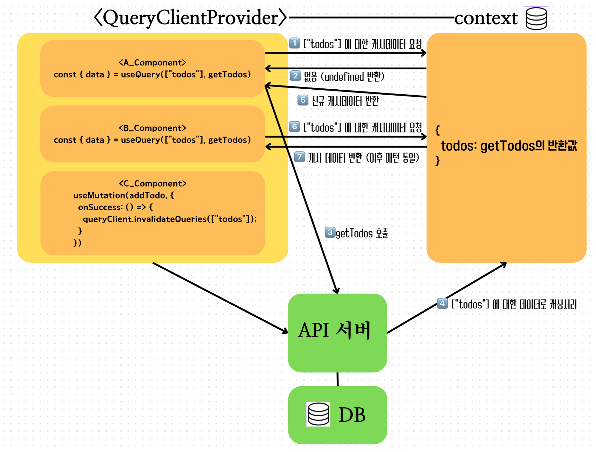

# Tanstack Query

`Tanstack Query`는 서버 상태를 관리하는 라이브러리다.

캐시기능이 있으며 요청중인지, 에러가발생했는지, 값을 반환해주며 탄스텍쿼리를 사용하지 않았을 경우보다 코드량이 적다.
<br />
<br />

## Tanstack Query의 SWR 전략

`Stale` 신선하지 않다. / 헌것 / 오래된것<br />
=> 오래된 것을 보여주고, 새것이 오면 새것을 보여줌

신규 데이터가 도착하는 동안 기존의 `캐싱된 데이터`를 사용하도록 하는 전략

서버의 헤더응답 설정 `Cache-Control` 에서 아이디어 기원함


위 그림의 진행방식대로 흘러간다.

1. ['todos'] 에 대한 캐시 데이터 요청 // 헌것을 보여줌
2. context 안에 ['todos'] 키 값의 정보를 조회수 반환 => 'undefined' // 현재 값을 갖고 있지 않음
3. 서버에 getTodos 호출
4. ['todos'] 에 대한 데이터를 캐싱함
5. ['todos'] 에 대한 신규데이터 를 반환 // 새것을 반환

<br />
<br />

## 그럼 캐시 데이터는 어디에 보관되나?

캐시 데이터는 `QueryClientProvider` 에 보관된다. <br />
`QueryClientProvider` 내부에 있는 모든 컴포넌트는 캐시 데이터에 접근할 수 있다.

<br />
<br />

## Tanstack Query 기본 세팅

```
$ npm i @tanstack/react-query

# or

$ pnpm add @tanstack/react-query

# or

$ yarn add @tanstack/react-query

# or

$ bun add @tanstack/react-query
```

```
// Tanstack Query Devtools

$ npm i @tanstack/react-query-devtools

# or

$ pnpm add @tanstack/react-query-devtools

# or

$ yarn add @tanstack/react-query-devtools

# or

$ bun add @tanstack/react-query-devtools
```

<br />
<br />

```jsx
import { QueryClient, QueryClientProvider } from "@tanstack/react-query";

const queryClient = new QueryClient();

ReactDOM.createRoot(document.getElementById("root")).render(
  <React.StrictMode>
    {/* QueryClientProvider 하위 요소는 Context에 캐시된 데이터를 사용할 수 있음 */}
    <QueryClientProvider client={queryClient}>
      <App />
    </QueryClientProvider>
  </React.StrictMode>
);
```
